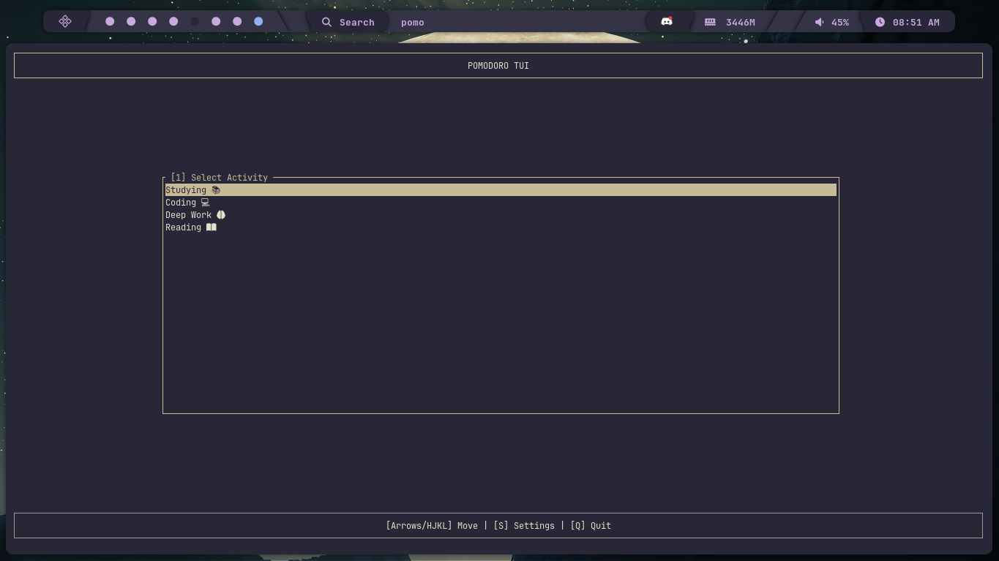
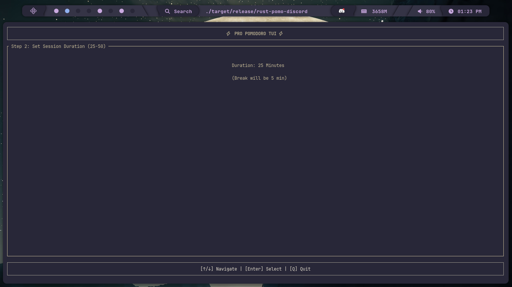
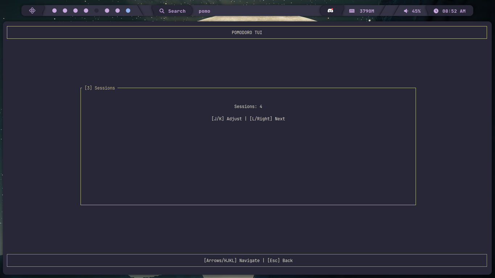
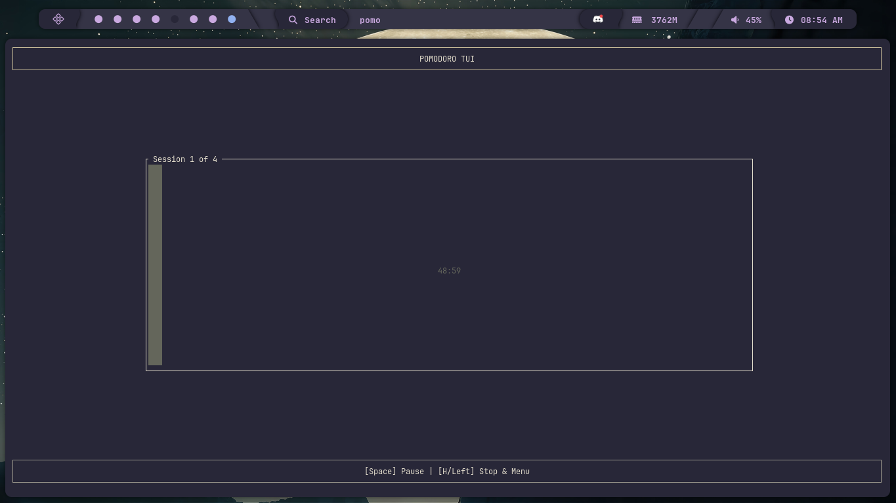
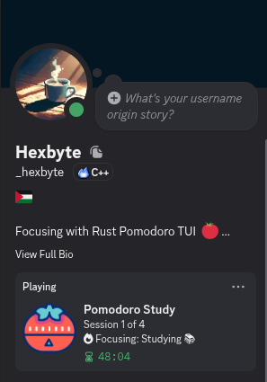

# 🦀 Pomodoro TUI  🚀

**Focus like a pro!** A high-performance Terminal User Interface (TUI) Pomodoro timer written in Rust. Sync your sessions with Discord, listen to your favorite YouTube BGM, and customize your experience with themes.

---

## ✨ Features | المميزات

*   **🎮 Discord Rich Presence:** Live countdown timer and pause status on your Discord profile.
*   **🎶 YouTube BGM Importer:** Download and play your favorite background music/songs directly from YouTube.
*   **Vim-Style Navigation:** Full support for `HJKL` and Arrow keys.
*   **🎨 Custom Themes:** Change the look of your app (Cyan, Magenta, Green, Yellow, Red).
*   **🔔 System Notifications:** Get notified when a session or break ends.
*   **⏱️ Infinite Customization:** Set any duration for sessions and breaks.
*   **⚡ Lightweight & Fast:** Built with Rust, consumes less than 10MB of RAM.

---

## 📸 App Showcase | عرض التطبيق

### 1️⃣ Main Menu | القائمة الرئيسية


### 2️⃣ Flexible Setup | إعداد مرن للجلسات
*Choose your activity, custom duration, and sessions:*

| Duration Selection | Session Count |
| :---: | :---: |
|  |  |

### 3️⃣ Live Focus Mode & Discord | وضع التركيز وتكامل ديسكورد
*Beautiful Gauge with live Discord presence:*




---

## 🛠️ Installation | التحميل والتشغيل

### 🟦 Arch Linux (AUR)
If you are using Arch, Manjaro, or EndeavourOS:
```bash
yay -S pomodoro-tui
```
*Then just type `pomo` in your terminal!*

### 🟧 Universal (Linux & macOS)
One-line installer:
```bash
curl -sSL https://raw.githubusercontent.com/hexbyte16/rust-pomo-discord/main/install.sh | bash
```

### 🟫 Developers (Cargo)
```bash
cargo install pomodoro-tui-discord
```

### ⬜ Windows
1. Go to the [Releases](https://github.com/hexbyte16/rust-pomo-discord/releases) page.
2. Download `pomo-windows.zip`.
3. Extract and run `pomo.exe`.

---

## 📋 Requirements | المتطلبات
To use the **YouTube Import** features, ensure you have these installed:
*   `yt-dlp`
*   `ffmpeg`

---

## ⌨️ Control Keys | أزرار التحكم

| Key | Action | الوصف |
|-----|--------|-------|
| `Space` | Play / Pause | تشغيل / إيقاف مؤقت |
| `H / Left` | Back / Stop | عودة / إيقاف المؤقت |
| `L / Right / Enter`| Select / Next | اختيار / المرحلة التالية |
| `J / K / Arrows` | Navigate / Adjust | التنقل / تعديل القيم |
| `S` | Settings | الإعدادات |
| `I` | Import BGM | استيراد موسيقى من يوتيوب |
| `Q / Esc` | Quit | خروج |

---

## 🛡️ Privacy & Security
This application is **Open Source**. It only communicates locally with your Discord client via IPC. No personal data is collected or sent to any server.

---

## 🤝 Contribution
Found a bug? Have an idea? Feel free to open an **Issue** or submit a **Pull Request**! 

**Made with ❤️ and 🦀 by [Islam/Hexbyte]**

